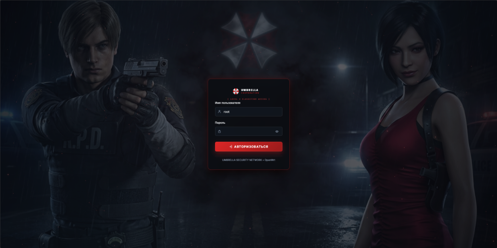
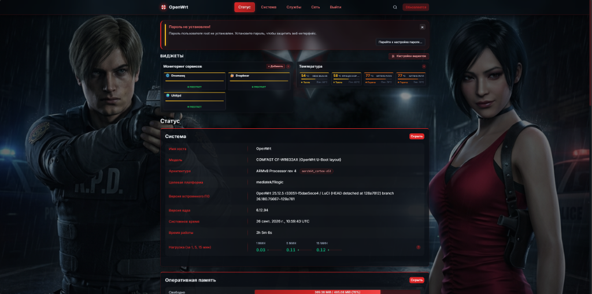

# ☣️ luci-theme-ResidentEvil (Umbrella Corporation Edition)

[](https://openwrt.org/)
[](https://github.com/openwrt/luci)
[](https://github.com/rock12/luci-theme-ResidentEvil)
[](https://github.com/rock12/luci-theme-ResidentEvil/releases/latest)
[](LICENSE)

Тёмная высокотехнологичная тема оформления для веб-интерфейса LuCI (OpenWrt 23.05, 24.10, 25.12+), вдохновлённая серией **Resident Evil** и стилизованная под секретный защищённый терминал безопасности **Umbrella Corporation**.

> **Основано на:** замечательном проекте [**luci-theme-proton2025**](https://github.com/ChesterGoodiny/luci-theme-proton2025) от [**ChesterGoodiny**](https://github.com/ChesterGoodiny).  
> Выражаем огромную благодарность автору за превосходную ucode-архитектуру, высокую скорость работы и гибкую систему настроек.

---

## 📸 Скриншоты интерфейса

### Экран авторизации (Hive Security Terminal)
*Леон Кеннеди (R.P.D.) и Ада Вонг обрамляют терминал доступа Umbrella Corporation:*


---

### Панель управления LuCI (Resident Evil Dashboard)
*Виджеты сервисов, температурных зон процессора/Wi-Fi и системная сводка:*


---

## ☣️ Что было сделано и особенности темы

### 🧟 1. Кинематографичный экран входа
- **Детализированный арт героев:** Леон С. Кеннеди в форме R.P.D. слева и Ада Вонг справа. Персонажи расположены точно по краям широкоформатного экрана и не перекрывают форму авторизации.
- **Стилизация под закрытый терминал:** логотип корпорации, заголовок `UMBRELLA CORPORATION [ LEVEL 8 CLASSIFIED ACCESS ]` и фирменная маркировка безопасности.
- **Атмосферные эффекты:** динамический тёмный дождь, стелющийся туман и летящие алые искры на фоне эмблемы Umbrella.

### 🛡️ 2. Фирменный стиль Umbrella Corporation
- **Векторные SVG-логотипы:** оригинальный красно-белый зонтик Umbrella в навигационной панели и на странице логина (`logo.svg` и `brand.svg`).
- **Цветовая гамма:** глубокий карбоново-графитовый фон (`#080a0e`) с контрастной неоново-алой подсветкой Umbrella Crimson (`#dc2626` / `#ef4444`).
- **Стеклянный дизайн (Glassmorphism):** полупрозрачные карточки с деликатной тонкой рамкой и мягким размытием заднего плана (`backdrop-filter: blur`).
- **Интерактивные элементы:**
  - Предупреждение «Пароль не установлен!» встроено в верхнюю часть страницы с удобной кнопкой быстрого закрытия `×` (запоминается в сессии браузера).
  - Модальные окна (например, «Сессия истекла») используют мягкое полупрозрачное размытие вместо глухого чёрного экрана.
  - Контент аккуратно отцентрирован и сбалансирован.

### 📊 3. Встроенные интерактивные виджеты (Status / Обзор)
- **Мониторинг температуры в реальном времени:**
  - Опрос всех доступных термозон (`/sys/class/thermal` и `/sys/class/hwmon`): CPU, радиомодули Wi-Fi (MT7915 PHY0, MT7915 PHY1) и др.
  - Все датчики компактно выстроены в **одну горизонтальную строчку**.
  - Цветовая дифференциация нагрева в стиле Resident Evil (Зелёный — Норма, Жёлтый — Тепло, Оранжевый — Горячо, Красный — Критично).
  - Индикация пиковых температур и живые анимированные пульсирующие индикаторы.
- **Мониторинг сервисов:**
  - Карточки статуса запущенных служб (Dnsmasq, Dropbear, Uhttpd и др.) с живой проверкой активности.
  - Визуально и по высоте полностью соответствуют карточкам датчиков температуры.
  - Кнопка `[+ Добавить]` прямо в шапке блока для быстрого добавления отслеживаемых сервисов.
- **Центр настроек виджетов:**
  - Выделенная кнопка `[⚙ Настройки виджетов]` с поиском и тумблерами для удобного включения и отключения необходимых модулей.

---

## 🛠️ Требования

- **OpenWrt:** 23.05, 24.10, 25.12 (снапшоты и релизы)
- **LuCI:** на базе `ucode` (`luci-base`)
- **Архитектура:** любая (`all` — пакет не зависит от процессора: MediaTek, Qualcomm, x86_64, ARM, MIPS и др.)
- Доступ к роутеру по SSH под пользователем `root`.

---

## 🚀 Установка одной командой

Подключитесь к роутеру по SSH и выполните команду:

```sh
wget -qO- https://raw.githubusercontent.com/rock12/luci-theme-ResidentEvil/main/install.sh | sh
```

> **Что делает скрипт:**
> 1. Автоматически определяет тип пакетного менеджера (`apk` для новых версий или `opkg` для классических).
> 2. Скачивает свежий релизный пакет нужного формата из GitHub Releases.
> 3. Устанавливает тему, настраивает зависимости и активирует её в LuCI по умолчанию.

После установки обновите страницу в браузере с очисткой кэша (**Ctrl + F5**).

---

## 🔄 Обновление

Для обновления темы до самой последней версии просто запустите команду установки повторно:

```sh
wget -qO- https://raw.githubusercontent.com/rock12/luci-theme-ResidentEvil/main/install.sh | sh
```

---

## 🗑️ Удаление

Чтобы вернуть стандартную тему и полностью удалить файлы Resident Evil Edition:

```sh
wget -qO- https://raw.githubusercontent.com/rock12/luci-theme-ResidentEvil/main/uninstall.sh | sh
```

---

## 📦 Ручная установка из релизов

Готовые пакеты всегда доступны на странице [**GitHub Releases**](https://github.com/rock12/luci-theme-ResidentEvil/releases/latest):

- **`.apk`** — для OpenWrt 25.12+ (пакетный менеджер `apk`):
  ```sh
  apk add /tmp/luci-theme-proton2025-*.apk
  ```
- **`.ipk`** — для OpenWrt 23.05 и 24.10 (пакетный менеджер `opkg`):
  ```sh
  opkg install /tmp/luci-theme-proton2025_*_all.ipk
  ```

---

## ⚙️ Дополнительные настройки темы

После установки доступна расширенная панель кастомизации:  
**Система → Система → Язык и стиль (Language and Style)**:
- **Внешний вид:** регулировка акцентного оттенка, фонового свечения, анимаций частиц.
- **Инструменты:** проверка обновлений, пересборка поискового индекса, резервное копирование и сброс параметров.
- **Горячий поиск:** строка быстрого поиска по меню и страницам LuCI в верхней панели.

---

## 👥 Благодарности и авторы

- **Оригинальный движок темы:** [ChesterGoodiny/luci-theme-proton2025](https://github.com/ChesterGoodiny/luci-theme-proton2025) (Apache-2.0).
- **Стилизация Resident Evil & Umbrella Corp:** [rock12](https://github.com/rock12/luci-theme-ResidentEvil).
- **Шрифт Inter:** The Inter Project Authors (SIL Open Font License 1.1).
- **Элементы анимаций:** Pavel Dobryakov (WebGL Fluid Simulation, MIT).

---

## 📄 Лицензия

Проект распространяется под лицензией **Apache 2.0**. Подробности в файле [LICENSE](LICENSE).
